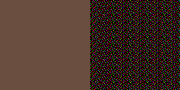
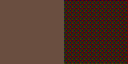

# Geometric Mixing Calculation

## An Ordered Dithering Method

Geometric Mixing Calculation (GMC) is an ordered dithering algorithm that is compatible with the classic Bayer kernels along with other ordered dithering kernels. It is a drastic improvement on naïve ordered dithering, where the kernel is used to shift the colour of a pixel before determining the closest colour. It is based on an observation that is best illustrated with a simple example. When a solid colour is dithered, ideally the pattern that is produced should average out to the same solid colour that was input. This happens quite naturally with an error-diffusion dither.

Here, the sRGB colour #6A4E40 (a brown colour) is error diffused with the Atkinson kernel over 128x128 pixels with an 8-colour palette consisting only of 1-bit-per-channel colours (that is, each of the RGB channels can only be 0x00 or 0xFF). If smoothed out adequately enough, the dithered result mixes roughly back towards the original colour. 6 colours from the palette participate in this dithering. But, if we view the colour space geometrically, we can see quite quickly that we only need to mix together up to 4 different colours in order to represent any colour that lies within the tetrahedron defined by these 4 colours (which will be the vertices to that tetrahedron).

## Dithering algorithm

So now the basis of this algorithm should become clear. When doing the actual dithering, for each pixel, the following is applied:

1. Given the input pixel colour in linear RGB, determine the surrounding tetrahedron made of colours from the palette. If the input colour is out of the gamut of the palette (defined as the convex hull of the palette colour points in linear RGB space), find the most suitable triangle/line/point to project to. (All these shapes will now be referred to as 'simplices')

2. Convert the input pixel colour to barycentric coordinates suitable for the surrounding simplex. Use these barycentric coordinates to calculate the proper mix thresholds. The colours of the simplex are assumed to be sorted by luminosity such that higher mix thresholds apply to brighter colours.

3. Get the appropriate threshold from the dither kernel using the position of the pixel.

4. Compare the kernel threshold against the mix thresholds, selecting the palette colour that corresponds to the mix threshold which the kernel threshold is closest to but still below.

5. Write the selected colour to the output pixel.

The **input pixel colour** is a 3-component vector of floats denoted as I with components (Ir, Ig, Ib). The **input pixel position** is denoted as P with components (Px, Py).

A **dither kernel** is an array of width N and height M of integers from 0 to (N\*M)-1. A **kernel threshold** is obtained from the dither kernel by taking the element at position (Px mod N, Py mod M), converting it to floating point and dividing by N\*M.

## Acceleration structure generation algorithm

The most complicated part of the dither algorithm is step 1. This is because determining the correct simplex to use for the later steps is not trivial. The most obvious way to go forward is to generate a **simplicial complex**, or mesh of tetrahedra/triangles/lines, and then generate an **acceleration structure** to speed up the determination of the proper simplex given the input pixel colour. Both of these steps are done after the palette is known but before doing the dithering. Therefore, it is possible to cache this structure and use it multiple times, as it only becomes invalid if the palette changes.

1. Determine the dimensionality of the palette. (Can the palette colours be reduced to a plane or a line?)

2. Using the dimensionality, generate a simplicial complex.

   3D: Use the Bowyer-Watson algorithm to generate a Delaunay tetrahedrisation of the points.

   2D: Transform to plane-local coordinates, then use the Bowyer-Watson algorithm to generate a Delaunay triangulation of the points.

   1D: Generate one line segment for each pair of adjacent points.
   
   Both the 2D and 3D cases include an extra small coordinate transform to break an annoying symmetry that arises when doing Delaunay triangulations on cuboidal grids. This makes the triangulation more reliable.

3. Given the dimensionality and the simplicial complex, generate a BSP tree. The leaf nodes contain the indices of the colours that make up the simplex, sorted such that lighter colours come last. The penultimate nodes must determine that the point definitely lies in a certain simplex.

The **dimensionality** is determined by the following algorithm:

1. If there are 2 colours, the dimensionality is 1.

2. If there are 3 colours, the dimensionality is at most 2.

3. The first 2 colours are used as a basis vector (B0), and each further point is used to generate a test basis vector (BT). The cross product BT x B0 is calculated, and if its magnitude is not negligible, then the dimensionality is at least 2.

4. If the dimensionality is already determined to be at least 2 (but could still be 3), use the last BT as a new basis vector (B1). Each further point generates a new BT. The triple product BT . (B0 x B1) is calculated, and if its magnitude is not negligible, then the dimensionality is 3.

## Calculation of mix thresholds

Step 2 involves a coordinate transform to calculate **mix thresholds**. These thresholds must lie in the range \[0.0, 1.0\]. We define C0, C1, C2 and C3 to be the four colours of the simplex, and M0, M1, M2, M3 to be the mix thresholds. The exact calculation depends on the dimensionality of the surrounding simplex:

- One colour (point): No calculation, the colour of the point is taken as-is. (effectively, M0 = 1.0)

- Two colours (line): Define T = I - C0, and B0 = C1 - C0. Therefore, M0 = 1.0 - (T . B0/B0 . B0), M1 = 1.0.

- Three colours (triangle): Define T = I - C), B0 = C1 - C0, B1 = C2 - C0. Define further B2 = B0 x B1 and D = B0 . (B1 x B2). Therefore, F1 = ((B1 x B2) . T)/D, F2 = ((B2 x B0) . T)/D, and thus M0 = 1.0 - F1 - F2, M1 = 1.0 - F2, M2 = 1.0.

- Four colours (tetrahedron): Define T = I - C), B0 = C1 - C0, B1 = C2 - C0, B2 = C3 - C0. Define further D = B0 . (B1 x B2). Therefore, F1 = ((B1 x B2) . T)/D, F2 = ((B2 x B0) . T)/D, F3 = ((B0 x B1) . T)/D, and thus M0 = 1.0 - F1 - F2 - F3, M1 = 1.0 - F2 - F3, M2 = 1.0 - F3, M3 = 1.0.

## Example results

Here, the sRGB colour #6A4E40 (a brown colour) is dithered with this algorithm over 128x128 pixels with an 8-colour palette consisting only of 1-bit-per-channel colours. The kernel used here is the 16x16 Bayer pattern.

Here, a synthetic image made by myself and rendered with Blender is dithered with a few methods. In the top-left is the original 256x256 image in full colour. In the top-right is the image dithered with error diffusion using the Atkinson kernel, with the same 8-colour palette as used for the previous image. In the bottom-left is the image dithered with GMC using the 16x16 Bayer pattern, using the same palette. And finally, in the bottom-right is the image dithered with the same palette using GIMP's built-in colour quantisation and positional dithering (via converting an image to indexed format), which appears to use a 4x4 Bayer pattern.

![Comparison of dithering of an image rendered with path tracing consisting of cylinders of various colours. On the very top are 16 colours which form the example palette. Top left is the original image, top right is the image dithered with Atkinson dithering to the given palette, bottom left is the image dithered with a 16x16 Bayer pattern using GMC and the same palette as before, and bottom right is the image dithered to the same palette using GIMP's positional dithering option (which is presumably using a 4x4 Bayer pattern.)](docimg/syntest_16.png)

Here, the same image is dithered in the same ways as before, but with a 16 colour palette that is given at the top of the image.
